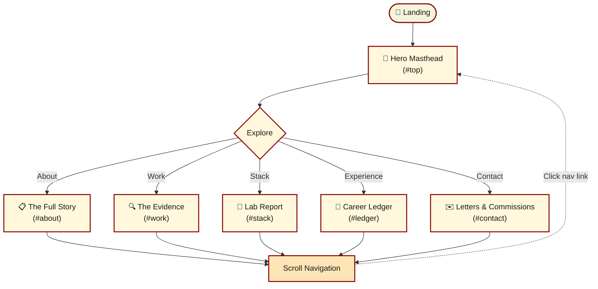

<div align="center">

# 📰 The Rahul Goswami Times

### A vintage editorial newspaper / detective dossier themed personal portfolio

Cream paper background · Serif headlines · Monospace metadata · Red rubber-stamp accents

<br/>


<br/>


</div>

<br/>

---

## 🧱 Tech Stack

<div align="center">

| Layer | Technology | |
|---|---|---|
| **Build Tool** | Vite 6.4 |  |
| **Framework** | React 18.3 |  |
| **Language** | TypeScript 5.0 |  |
| **Styling** | Tailwind CSS 3.4 |  |
| **Animations** | Framer Motion 11.1 |  |
| **Forms** | Web3Forms (no-server) |  |
| **APIs** | Vercel Serverless Functions |  |
| **Fonts** | Playfair Display + Space Mono |  |
| **Deployment** | Vercel |  |

</div>

---

## 📁 Project Structure

<details open>
<summary><b>Click to expand / collapse the full directory tree</b></summary>

```
Portfolio/
├── public/
│   └── logo.svg
│
├── src/
│   ├── animations/
│   │   └── index.jsx              ← shared animation utilities
│   │
│   ├── assets/
│   │   ├── jpeg/
│   │   │   └── profile.png
│   │   ├── projects/
│   │   │   ├── projects1.png
│   │   │   ├── projects2.png
│   │   │   └── projects3.png
│   │   └── cv.pdf
│   │
│   ├── components/
│   │   ├── book-call/
│   │   │   ├── components/        ← book-call sub-components
│   │   │   └── index.jsx
│   │   ├── career/
│   │   │   └── index.jsx          ← career ledger section
│   │   ├── contact/
│   │   │   ├── components/        ← contact form components
│   │   │   └── index.jsx          ← letters & commissions section
│   │   ├── education/
│   │   │   └── index.jsx
│   │   ├── footer/
│   │   │   ├── parts/             ← footer sub-components
│   │   │   └── index.jsx
│   │   ├── hero/
│   │   │   └── index.jsx          ← hero masthead section (#top)
│   │   ├── lab-report/
│   │   │   ├── components/        ← tech stack components
│   │   │   └── index.jsx          ← lab report section (#stack)
│   │   ├── loader/
│   │   │   └── index.jsx
│   │   ├── masthead/
│   │   │   └── index.jsx
│   │   ├── nav/
│   │   │   └── index.jsx          ← navigation component
│   │   ├── projects/
│   │   │   ├── components/        ← project card components
│   │   │   └── index.jsx          ← the evidence section (#work)
│   │   └── scroll-link/
│   │       └── index.jsx
│   │
│   ├── types/
│   │   ├── carrers/               ← career type definitions
│   │   ├── contact/               ← contact form types
│   │   ├── education/             ← education types
│   │   ├── hero/                  ← hero section types
│   │   ├── projects/              ← project types
│   │   ├── shared/                ← shared type definitions
│   │   └── stack/
│   │       ├── labels/            ← stack label components
│   │       ├── nodes/             ← stack node components
│   │       ├── threads/           ← stack thread components
│   │       ├── zones/             ← stack zone components
│   │       └── index.js           ← stack type definitions
│   │
│   ├── App.jsx
│   ├── index.css                  ← base styles & Tailwind imports
│   └── main.jsx
│
├── api/
│   ├── codechef.js                ← Vercel serverless: CodeChef stats
│   ├── github.js                  ← Vercel serverless: GitHub stats
│   └── leetcode.js                ← Vercel serverless: LeetCode stats
│
├── .env
├── .gitignore
├── eslint.config.js
├── index.html
├── package.json
├── postcss.config.js
├── tailwind.config.js             ← theme colors & customisation
├── vercel.json                    ← Vercel configuration
└── vite.config.js
```

</details>

---

## 🗺️ App Flow



---

## 📰 Sections

| Anchor | Section | Description |
|--------|---------|-------------|
| `#top` | Hero Masthead | Main landing area with newspaper-style masthead |
| `#about` | The Full Story | Biography and skills overview |
| `#work` | The Evidence | Project showcase with case-file styling |
| `#stack` | Lab Report | Technology stack in tabular format |
| `#ledger` | Career Ledger | Work experience timeline |
| `#contact` | Letters & Commissions | Contact form (Web3Forms) |

---

## 🚀 Getting Started

### Prerequisites


### Install dependencies

```bash
npm install
```

### Run locally

```bash
npm run dev
```

Open [http://localhost:5173](http://localhost:5173).

### Build for production

```bash
npm run build
npm run preview   # preview the dist/ output locally
```

---

## 🏗️ Build Commands

| Command | Description |
|---------|-------------|
| `npm run dev` | Start development server |
| `npm run build` | Build for production |
| `npm run preview` | Preview production build locally |
| `npm run lint` | Run ESLint |

---

## 🎨 Customisation

### Colors
Edit `tailwind.config.js` → `theme.extend.colors`

### Content
Edit the data arrays at the top of each component file in `src/components/`

### Contact Form
Update `src/components/contact/index.jsx` → `access_key` value (Web3Forms)

---

## 🤝 Contributing

```bash
# 1. Create a feature branch
git checkout -b feature/<short-description>

# 2. Make your changes
npm run lint

# 3. Stage and commit
git add .
git commit -m "feat: add new section"

# 4. Push and open a PR
git push origin feature/<short-description>
```

---

## 📜 License

Personal portfolio — open source for reference.

---

<div align="center">

Made by Rahul Goswami 📰

</div>