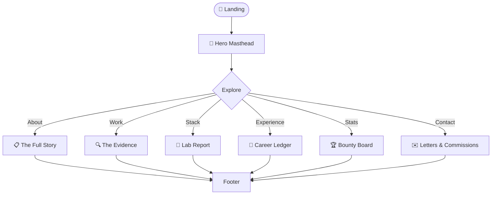

<div align="center">

# 📰 The Rahul Goswami Times

### A vintage editorial newspaper / detective dossier themed personal portfolio

Cream paper background · Serif headlines · Monospace metadata · Red rubber-stamp accents

<br/>


<br/>


</div>

<br/>

---

## 🧱 Tech Stack

<div align="center">

| Layer | Technology |
|---|---|
| **Build Tool** | Vite 7.x |
| **Framework** | React 19.x |
| **Styling** | Tailwind CSS 3.4 |
| **Animations** | Framer Motion 13.x · GSAP 3.x |
| **Charts** | Recharts 3.x |
| **Routing** | React Router DOM 7.x |
| **Forms** | Web3Forms (no-server contact form) |
| **APIs** | Vercel Serverless Functions (LeetCode · GitHub · CodeChef) |
| **Fonts** | Playfair Display · Space Mono · Oswald |
| **Deployment** | Vercel |

</div>

---

## 📁 Project Structure

<details open>
<summary><b>Click to expand / collapse</b></summary>

```
Portfolio/
├── public/
│   ├── favicon.svg
│   ├── logo.svg
│   ├── manifest.json
│   ├── robots.txt
│   └── sitemap.xml
│
├── src/
│   ├── animations/
│   │   └── index.jsx              ← shared animated icon components
│   │
│   ├── assets/
│   │   ├── jpeg/                  ← profile & doodle images
│   │   ├── projects/              ← project screenshots
│   │   ├── svgs/                  ← brand & tech icons
│   │   └── cv.pdf
│   │
│   ├── components/
│   │   ├── book-call/             ← booking form page
│   │   ├── bounty/                ← live stats dashboard (LeetCode · GitHub · CodeChef)
│   │   │   ├── components/        ← StatCard, PlatformCard, OverviewGrid, TechMastery
│   │   │   ├── graphs/            ← DonutChart, RadarChart, ContributionGrid, MiniLineChart
│   │   │   └── hooks/             ← useStatsData (API fetching)
│   │   ├── career/                ← career ledger section
│   │   ├── contact/               ← contact form section
│   │   ├── education/             ← education section
│   │   ├── footer/                ← footer with social links & copyright
│   │   ├── hero/                  ← hero masthead
│   │   ├── lab-report/            ← tech stack section
│   │   ├── loader/                ← intro loader animation
│   │   ├── masthead/              ← newspaper masthead bar
│   │   ├── nav/                   ← navigation
│   │   ├── projects/              ← project showcase
│   │   └── scroll-link/           ← smooth scroll utility
│   │
│   ├── hooks/                     ← global custom hooks
│   │
│   ├── types/                     ← data constants & type definitions
│   │   ├── bounty/
│   │   ├── carrers/
│   │   ├── contact/
│   │   ├── education/
│   │   ├── hero/
│   │   ├── projects/
│   │   ├── shared/
│   │   └── stack/
│   │
│   ├── App.jsx
│   ├── index.css                  ← Tailwind base + global styles
│   └── main.jsx
│
├── api/
│   ├── codechef.js                ← Vercel serverless: CodeChef stats
│   ├── github.js                  ← Vercel serverless: GitHub stats
│   └── leetcode.js                ← Vercel serverless: LeetCode stats
│
├── .env                           ← API keys (never committed)
├── eslint.config.js
├── index.html
├── package.json
├── postcss.config.js
├── tailwind.config.js
└── vite.config.js
```

</details>

---

## 📰 Sections

| Anchor | Section | Description |
|--------|---------|-------------|
| `#top` | Hero Masthead | Newspaper-style landing with animated intro |
| `#about` | The Full Story | Bio and skills overview |
| `#work` | The Evidence | Project showcase with case-file styling |
| `#stack` | Lab Report | Technology stack display |
| `#ledger` | Career Ledger | Work experience timeline |
| `#bounty` | Bounty Board | Live coding stats dashboard |
| `#contact` | Letters & Commissions | Contact form via Web3Forms |

---

## 🗺️ App Flow



---

## 🚀 Getting Started

### Prerequisites

- Node.js ≥ 18
- npm 10.x

### Install & run

```bash
npm install
npm run dev
```

Open [http://localhost:5173](http://localhost:5173).

### Build

```bash
npm run build
npm run preview
```

---

## 🏗️ Commands

| Command | Description |
|---------|-------------|
| `npm run dev` | Start development server |
| `npm run build` | Production build |
| `npm run preview` | Preview production build |
| `npm run lint` | Run ESLint |

---

## 🌐 Serverless APIs

The `/api` folder contains Vercel serverless functions that fetch and cache live data:

| Endpoint | Source | Data |
|----------|--------|------|
| `/api/leetcode` | LeetCode GraphQL | Rating, solved counts, rank |
| `/api/github` | GitHub REST API | Repos, stars, followers, contributions |
| `/api/codechef` | CodeChef scrape | Rating, stars, contests |

Set the following in `.env`:

```env
GITHUB_TOKEN=your_github_pat
```

---

## 🎨 Customisation

- **Colors** — `tailwind.config.js` → `theme.extend.colors`
- **Content** — data arrays in `src/types/` folders
- **Contact form** — `access_key` in `src/components/contact/index.jsx` (Web3Forms)

---

## 📜 License

Personal portfolio — open source for reference.

---

<div align="center">

Made by Rahul Goswami 📰

</div>
